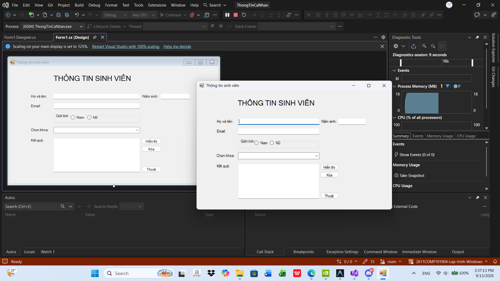
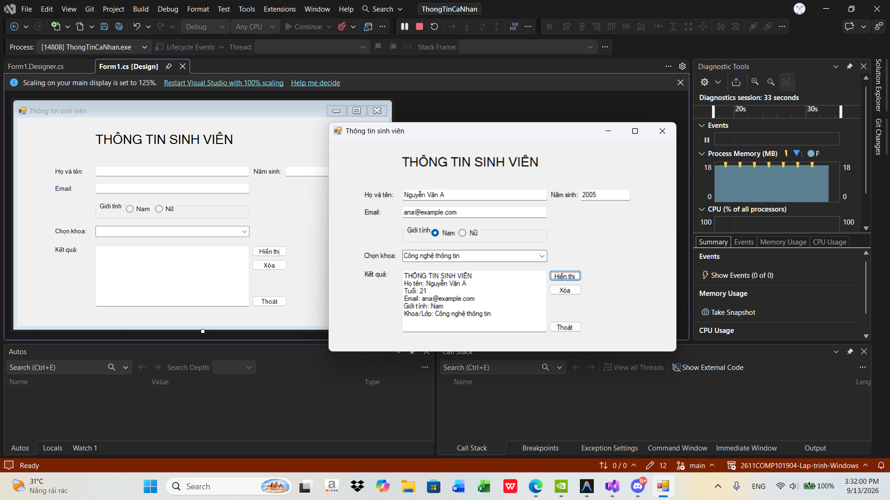
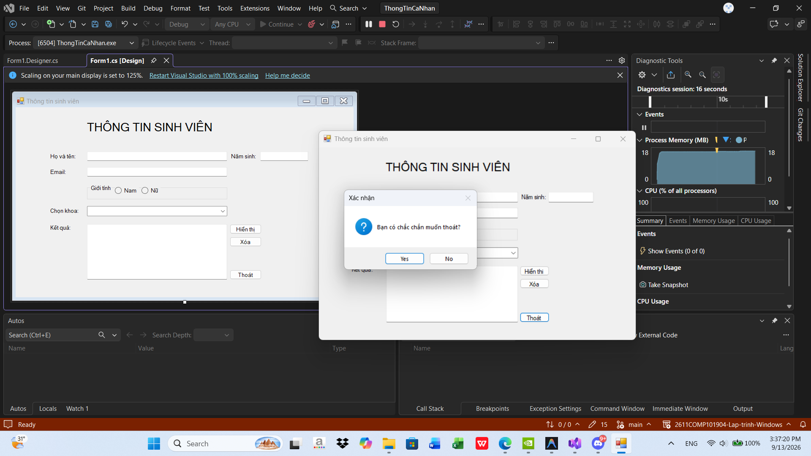

# Lab 01 - Chương trình Thông tin cá nhân

## Thông tin sinh viên
- Họ tên: Hoàng Dương Phúc Quang
- MSSV: 49.01.101.075
- Lớp: 49.01.TOAN.SN

## Mô tả
Ứng dụng WinForms cơ bản cho phép người dùng nhập và hiển thị thông tin cá nhân.

## Chức năng
- Nhập thông tin cá nhân: Họ tên, năm sinh.
- Chọn giới tính (RadioButton) và chọn Khoa (ComboBox).
- Nút thoát chương trình.

## Cách chạy
1. Mở file `.sln` bằng Visual Studio
2. Build solution
3. Chạy project

## Hình ảnh minh họa
Dưới đây là các hình ảnh kết quả chạy chương trình:

 

 

