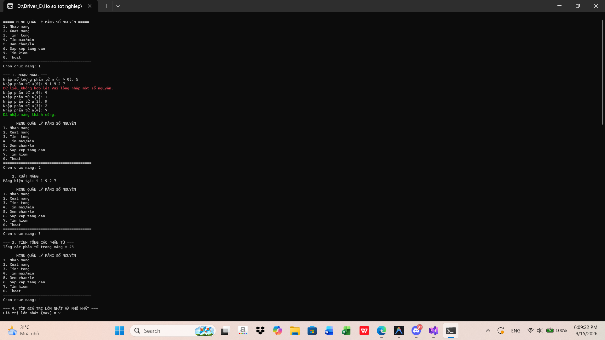
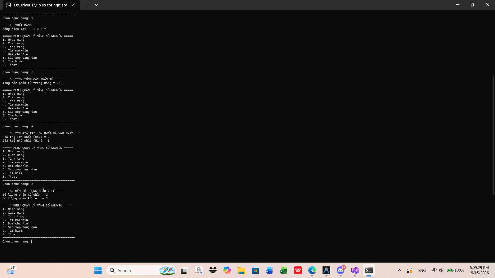
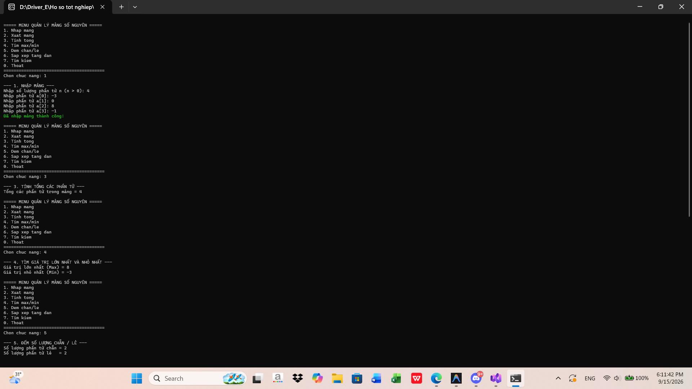
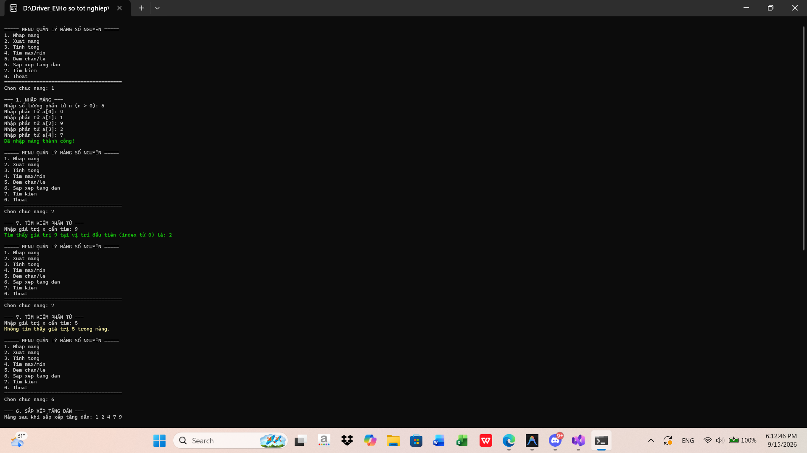
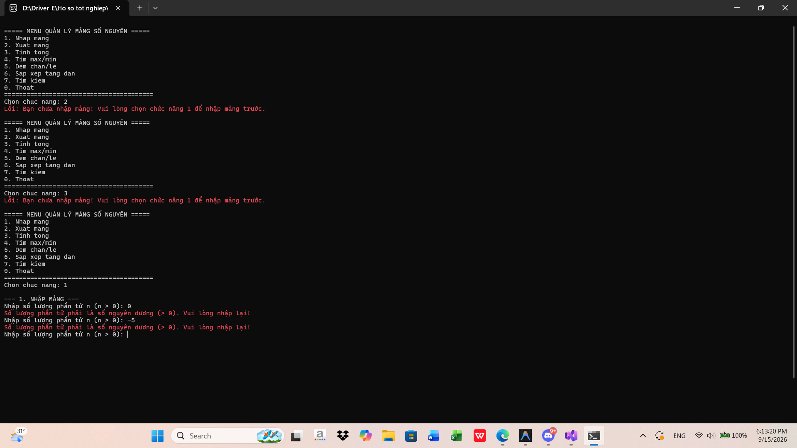

# Lab 02 - Quản lý mảng số nguyên

## Thông tin sinh viên
- Họ tên: Hoàng Dương Phúc Quang
- MSSV: 49.01.101.075
- Lớp: 49.01.TOAN.SN

## Mô tả
Chương trình Console C# quản lý mảng một chiều các số nguyên với menu lựa chọn chức năng.

## Chức năng
- Nhập mảng (kiểm tra n > 0) và xuất mảng.
- Tính tổng các phần tử trong mảng.
- Tìm phần tử lớn nhất và nhỏ nhất.
- Đếm số lượng phần tử chẵn và lẻ.
- Sắp xếp mảng tăng dần.
- Tìm kiếm giá trị x trong mảng.
- Thoát chương trình.

## Cách chạy
1. Mở file solution bằng Visual Studio
2. Build solution
3. Chạy project (nhấn Ctrl + F5)

## Hình ảnh minh họa
Dưới đây là các hình ảnh kết quả chạy chương trình:

